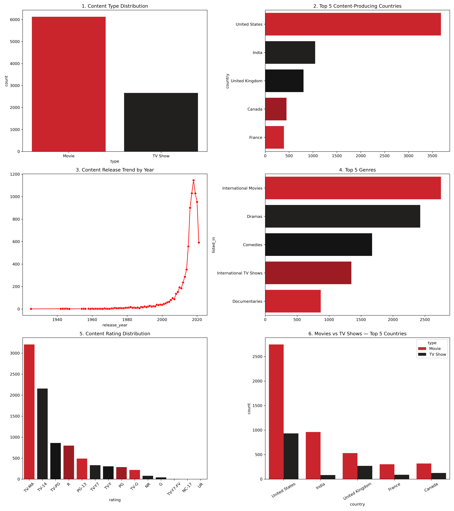

# 🎬 Netflix Content Analysis

## 📌 Project Overview
This project performs an end-to-end analysis of Netflix's content catalog using Python and Pandas. It covers data cleaning, exploratory data analysis (EDA), and visualization to uncover trends in content type, country of origin, release patterns, genres, and ratings — concluding with a business insights report.

## 🎯 Objectives
- Clean and prepare raw Netflix data for analysis
- Analyze the distribution of Movies vs TV Shows
- Identify top content-producing countries
- Examine content trends over time (by release year and date added)
- Explore content ratings and genres to understand audience targeting
- Summarize findings into actionable business insights

## 📊 Dataset
- - **Rows:** ~8,800 titles
- **Columns:** show_id, type, title, director, cast, country, date_added, release_year, rating, duration, listed_in, description

## 🛠️ Tools & Libraries
- Python
- Pandas
- Matplotlib & Seaborn
- Plotly (interactive visualizations)
- Jupyter Notebook

## 📁 Project Structure
1_data_cleaning.ipynb
├── 2_content_type_analysis.ipynb
├── 3_country_wise_analysis.ipynb
├── 4_trend_analysis.ipynb
├── 5_Content_rating_genre_analysis.ipynb
├── 6_business_insights_report.ipynb
├── netflix_cleaned.csv
└── README.md

## 🔑 Workflow

**1. Data Cleaning**
- Handled missing values (fillna for country/cast/rating, dropna for date_added/duration)
- Removed duplicate records
- Standardized columns (Country, Rating, Type)

**2. Content Type Analysis**
- Compared total Movies vs TV Shows
- Visualized content distribution and proportions

**3. Country-Wise Analysis**
- Extracted and split multi-country entries
- Identified top content-producing countries
- Built ranking charts

**4. Trend Analysis by Release Year**
- Extracted year/month/day from date_added
- Analyzed yearly and seasonal content trends
- Built heatmaps and line charts

**5. Rating & Genre Analysis**
- Analyzed content rating categories
- Identified most common genres
- Compared ratings across content types using interactive charts

**6. Business Insights Report**
- Combined all findings into a comprehensive dashboard
- Documented key business recommendations in a Word report

  # 📈 Dashboard Preview

## 📈 Key Findings
- Movies make up the majority of Netflix's content catalog compared to TV Shows
- The United States and India are the top content-producing countries
- Content additions peaked between 2018–2020
- International Movies and Dramas are among the most common genres
- TV-MA is the most frequent content rating, indicating a strong focus on mature audiences

## 👤 Author
Shrestha mohan negi 
[LinkedIn](https://www.linkedin.com/in/shrestha-mohan-negi-48758a389/) 

